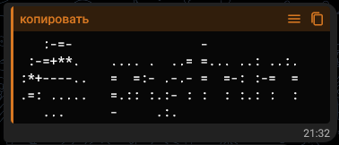
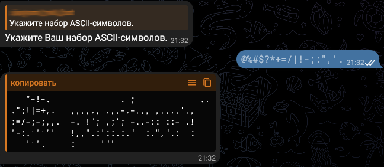

# Многофункциональный телеграм-бот

## ⚙ Зависимости

Разработка и тестирование производились на стеке:


Установка библиотек:
```bash
pip install telebot pillow
```

## 🖥 Использование

Запуск приложения производится командой
```bash
python bot.py
```

В Telegram-чате отвечает `Пришлите мне изображение, и я предложу Вам варианты!` на команды `start` и `help`.


В ответ на изображение сообщает `У меня есть Ваша фотография! Пожалуйста, выберите, что бы Вы хотели с ней сделать.`
и выводит три кнопки: `Пикселизация`, `ASCII-арт` и `Инверсия цветов`.


### Пикселизация
В ответ на нажатие кнопки `Пикселизация` возвращает изображение с пиксельным эффектом.


### ASCII-арт
В ответ на нажатие кнопки `ASCII-арт` просит указать набор ASCII-символов и выводит две кнопки: `Ввести свой набор` и
`Использовать набор по умолчанию`.


#### Использовать набор по умолчанию
В ответ на нажатие кнопки `Использовать набор по умолчанию` использует набор символов `@%#*+=-:.`, заканчивающийся
пробелом, для построения ASCII-арт — акцидентной графики, использующей символы ASCII для представления изображений.



#### Ввести свой набор 
В ответ на нажатие кнопки `Ввести свой набор` просит `Укажите Ваш набор ASCII-символов.` и ожидает ввода пользователя.
Введённые символы использует вместо набора по умолчанию. (Телеграм удаляет конечные пробелы. Получив набор
от пользователя, бот добавляет пробел в конце.)



### Инверсия цветов
В ответ на нажатие кнопки `Инверсия цветов` возвращает изображение с эффектом негатива.


